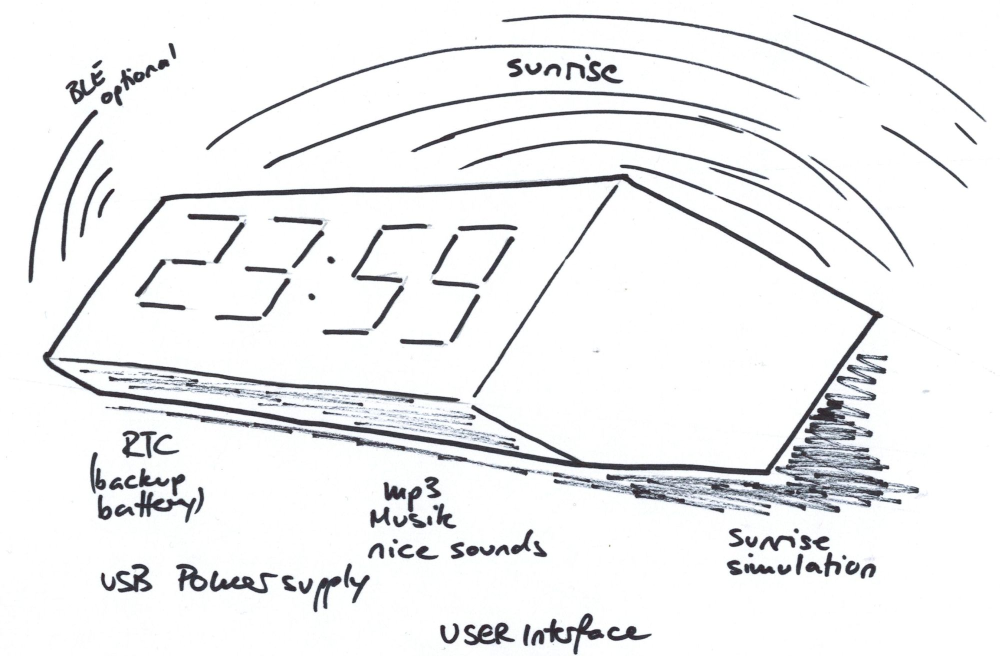

# Alarmclock - Docs

## aim, goal

- [ ] display present time and next alarm time
- [ ] wooden case, proportions using golden ratio a/b = 1.61803
- [ ] RTC with backup battery, temp compensation
- [ ] user interface
- [ ] alarm signals using mp3 from a usd card, [DFPlayer](https://starthardware.org/dfplayer-mini-mp3-player-fuer-arduino/)
- [ ] USB supply (micro USB)
- [ ] sunrise simulation using warm white LEDs
- [ ] optional BLE for a ble handdevice

## why

## related projects

+ git@github.com:mwuerms/alarmclock_ble_central.git
+ git@github.com:mwuerms/alarmclock_ble_handdevice.git

## structure
